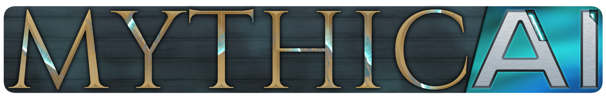

<sub>Advanced, shareable, and easily expandable text-generation + miscellaneous platform, designed for modularity and affordability. Local text generation without compromising on quality and versatility. The possibilities of AI now at your finger tips.</sub>
<hr>
<p align="center">
<br>
<sub>Minimalistic interface</sub>
</p>

## Download & Installation
~~Download the <a href="https://github.com/vortexdevsoftware/MythicAI/releases">latest release</a> for your platform.~~
_The software is currently in its early stages and is not yet available for download. Please check again later._

## Build from Source
Pre-requisites:<br>
1. <a href="https://git-scm.com/"> Git</a><br>
2. <a href="https://www.rust-lang.org/"> Rust + Cargo</a><br>
3. <a href="https://tauri.app/">Tauri</a> - <sub>Please check the [tauri prerequisites guide](https://tauri.app/v1/guides/getting-started/prerequisites/) for your system</sub>

### Clone the Repository
```shell
$ git clone https://github.com/vortexdevsoftware/MythicAI.git
$ cd MythicAI
$ git submodule update --init --recursive
```
### Install the Dependencies
```shell
$ npm install
```
### Test
```shell
$ npm run dev
```
### Build
```shell
$ npm run tauri build
```

## Usage
MythicAI does not need any pre-configuration before initialization, simply run the executable for your system.
> Please be aware that this is in its early stages and may not work on all systems. If the software is not functioning correctly on your system, kindly open and report the issue.

## Get Involved
We are constantly improving and expanding our features. We warmly welcome contributions from individuals such as you, who can bring fresh ideas and perspectives to the table. Your input, be it through suggestions, or code contribution is priceless to us!

Don't hesitate to take an active role in shaping the future of this project. Check out the <a href="https://github.com/orgs/vortexdevsoftware/projects/4">MythicAI Features</a> project page to get started.

## Plugins
Plugins serve as a means to offer instructions to the environment regarding the content generation and its methods. They enable a more dynamic and adaptable experience, as plugins can effortlessly incorporate standardized UI elements into the MythicAI interface.

MythicAI provides several built-in plugins:
1. **Default**:
A straightforward text-completion playground equipped with standard configuration options.
1. **Chatbot**:
A text-message-based chat feature that allows you and, optionally, your friends to engage in group chats with a personalized AI.
2. **RPG-Story Plugin**:
Serving as the flagship feature for MythicAI and the inspiration behind its name, the RPG-Story plugin delivers exceptional control over your scenarios, enabling you and your friends to participate in immersive roleplaying experiences.
- **Modalities**:
Modalities represent various combinations of prevalent scenarios and styles that you can utilize for your stories.

## Connecting Users
We are working on a multi-user experience, it will be possible to connect with your friends and progress your stories along them.

*This is currently work-in-progress and will be added soon!*

For now, use the [Forum](https://vortex-dev.com/forums/t/mythicai) or [Discord Server](https://discord.gg/Vvw8JV47) to connect with other users.
<!---This is made possible by connecting them to a rendezvous server, such as vortex-dev.com. We are only a proxy for the local server, and do not store any data that would be sent through your MythicAI. Projects that use <a href="https://gradio.app/sharing-your-app/">gradio URL sharing</a> also benefit from the same setup.-->

## Terms of Use
The source code of this project is licensed under **GNU General Public License v3.0**.

Regarding usage of the "software" see [terms-of-use.md](public/terms-of-use.md) for details.

## About The Developer
MythicAI is developed and maintained by Vortex Interactive, a brand of The Arc Network.

Websites: [Vortex](https://vortex-dev.com) and [The Arc Network](https://thearcnetwork.net)
